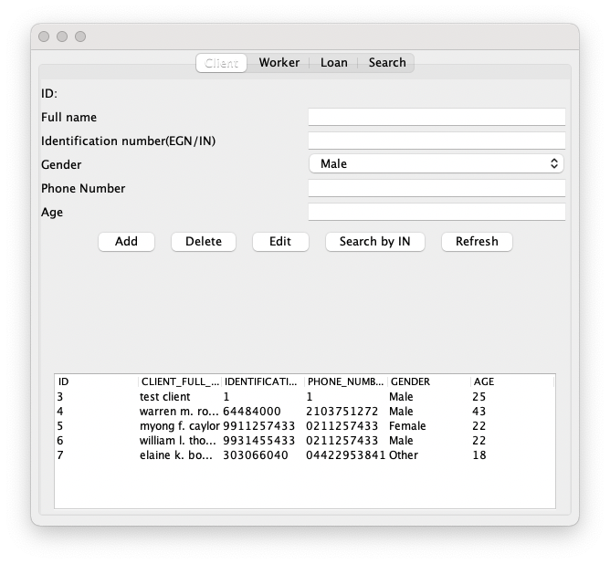
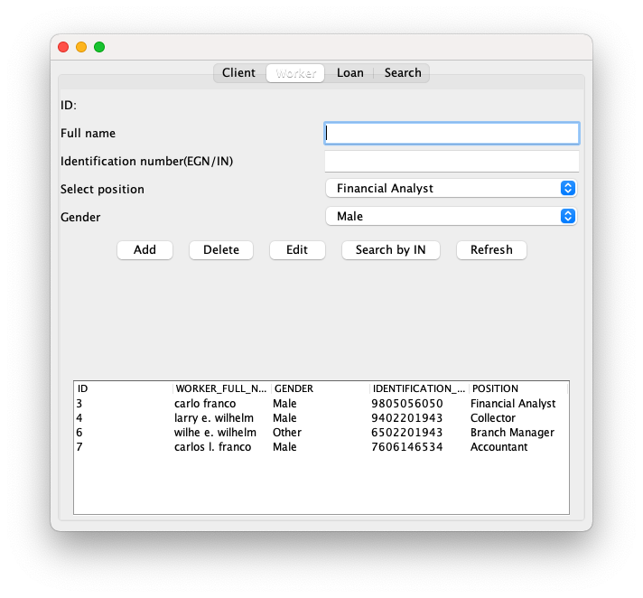
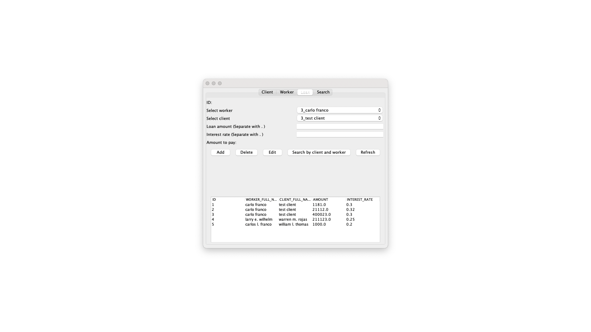
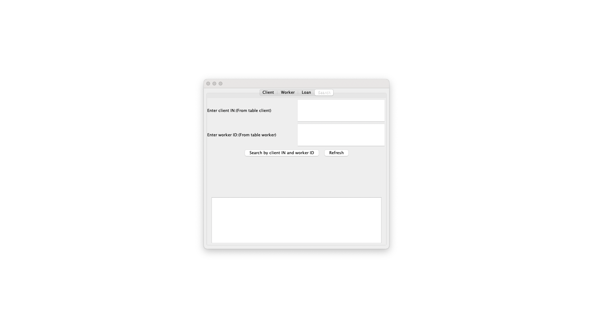

# LoanTracker

Java desktop application that track loans and stores the information into H2 server.

If you want to try the project you should change the conection string in /LoanDesktopApplication/src/com/LoanDesktopApplicationid/DBConnection.java. 

You can recreate the database by using DataBase.txt in  /LoanDesktopApplication/src/com/LoanDesktopApplicationid/

# Database Schema

# Images 

The images containts non real user information!

